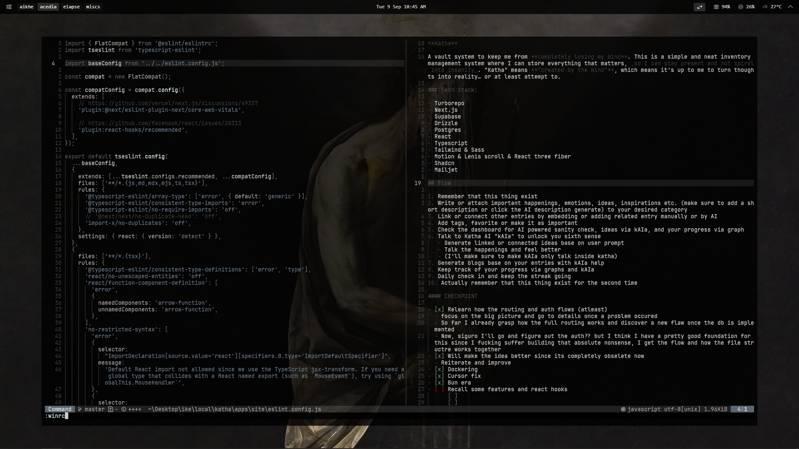

# My Windows Config

## Code Editor

- [Neovide](https://github.com/neovide/neovide)
- [Neovide Config File](./neovide/config.toml)
- Neovide directory: `%USERPROFILE%/AppData/Roaming/neovide`

Check other neovide configs in my [nvim configuration](https://github.com/aikhe/aikhe-nvim-config)

## Browser Setup

- [Zen Browser](https://zen-browser.app/)

To setup Zen

- Copy [userChrome.css](./zen/chrome/userChrome.css/) widget to `%USERPROFILE%/AppData/Roaming/zen/Profile/(releasae)/chrome` directory
- For exporting zen mods [Zen mods config](./zen/zen-mods-export.json)
- To turn on compact mode, enable the `browser.compactmode.show` preference to true in `about:config` and then select "Compact (not supported)" from the "Density" menu in the "Customize Toolbar" panel.

## Wezterm

- [Wezterm](https://wezterm.org/index.html)
- Copy [wezterm config](./wezterm/.wezterm.lua) in `%USERPROFILE%/` directory

## Powershell Aliases + Yazi

- Copy [WindowsPowershell](./WindowsPowerShell//) to `Documents` directory

## Window Manager Setup

- [GlazeWM](https://github.com/glzr-io/glazewm)

To configure GlazeWM:

- Copy [GlazeWM config](./glazewm/) in `%USERPROFILE%/.glzr` directory

## TopBar Setup

- [Zebar](https://github.com/glzr-io/zebar)

To configure Zebar:

1. Copy [zebar](./zebar/) widget to `%USERPROFILE%/.glzr` directory

```
cp ./zebar/ ~/.glzr/zebar/
```

2. Than disable other widgets in Zebar system tray.

## Searching

- [Powertoys Run](https://learn.microsoft.com/en-us/windows/powertoys/run)

Set up `Windows + Space` key for PowerToys run

## File Manager

- [Yazi](https://github.com/sxyazi/yazi)
- Yazi directory: `%USERPROFILE%/AppData/Roaming/yazi`

To configure Yazi:

- For options copy [yazi.toml](./yazi/yazi.toml/) in `%USERPROFILE%/AppData/Roaming/yazi/config` directory
- And for colorscheme copy [theme.toml](./yazi/theme.toml/) in `%USERPROFILE%/AppData/Roaming/yazi/config` directory

[documentation](https://yazi-rs.github.io/)

Windows Installtion

- Make sure yazi is installed and has the powershell configuration

```
winget install sxyazi.yazi
# Install the optional dependencies (recommended):
winget install Gyan.FFmpeg 7zip.7zip jqlang.jq oschwartz10612.Poppler sharkdp.fd BurntSushi.ripgrep.MSVC junegunn.fzf ajeetdsouza.zoxide ImageMagick.ImageMagick
```

#### My clean windows build process

- Debloat using [Talon](https://ravendevteam.org/software/talon/) (Talonlite for win10)
- Brave as main browser (might go back to Zen since I need the keybinds and vertical tabs)
- Discord just because
- Chocolatey for package manager
- Git of course + gh via `choco install gh`
- Installed all versions of `VCredist` so nothing can break. [All in one package](https://www.techpowerup.com/download/visual-c-redistributable-runtime-package-all-in-one/)
- GlazeWM for `tiling window manager` (efficient window handling)
- Also Zebar to support with GlazeWM (topbar)
- Import my config for both GlazeWM and Zebar
- Wezterm as default terminal (it's clean I like it)
- **Neovim my beloved**
  - [My nvim configuration](https://github.com/aikhe/nvim-config)
- Yazi for file manager inside the term
- Notion for everything
- Figma + Affinity
